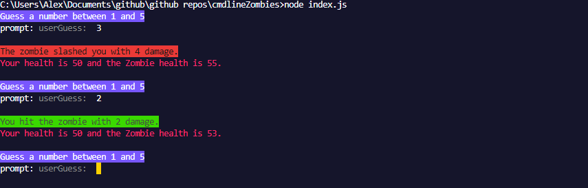

# Zombie Duel

Zombie duel is a text-based command line game where the user guesses a number between 1 and 5 and if the guess matches the zombies guess. The user does damage to the zombie.

If the user guesses the incorrect number the user will take damage.

The amount damage differs each round and is also a number between 1 and 5.

The game stops when either the user or zombies health reaches 0 or less.

